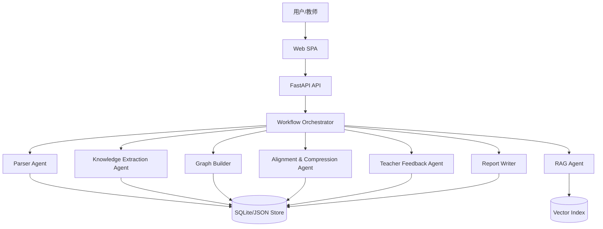

# AGENTS.md

## 项目定位

本项目面向“AI 全栈极速黑客松：学科知识整合智能体开发”。目标是在 5 小时内交付一个可演示、可部署、可复现的 Web 应用，把赛方提供的 7 本医学教材整合为可视化知识图谱、去重压缩后的精华知识库，以及带原文引用的 RAG 问答系统。

当前教材主题覆盖：

- 局部解剖学
- 组织学与胚胎学
- 生理学
- 医学微生物学
- 病理学
- 传染病学
- 病理生理学

这些 PDF 文件仅作为本地测试数据使用，不得提交到 GitHub。

## 第一原则

1. 先做完整可演示闭环，再做加分项。
2. 所有回答、整合决策和报告结论都必须能追溯到教材原文。
3. 医学内容不得凭模型常识编造，缺少证据时明确返回“当前知识库中未找到相关信息”。
4. 5 小时比赛中优先保证 P0：上传解析、知识图谱、跨教材整合、RAG 引用问答、多轮反馈、Web 界面、文档、报告。
5. 代码和文档都要服务于评分标准：可复现、可解释、可演示、可部署。

## 推荐技术路线

默认采用轻量、稳定、容易在比赛现场跑通的方案：

- 后端：FastAPI + Pydantic
- PDF 解析：PyMuPDF
- Markdown/TXT 解析：Python 标准库
- 可选 DOCX：python-docx
- 前端：React + Vite + TypeScript
- 图谱可视化：Cytoscape.js 或 ECharts Graph，优先选择更熟悉者
- 向量模型：BGE-small-zh、paraphrase-multilingual-MiniLM-L12-v2，或兼容中文的在线 embedding API
- 向量库：FAISS 或 ChromaDB
- 关键词检索：BM25，可作为 P1 加分
- LLM：通过环境变量配置 OpenAI、DeepSeek、通义千问等兼容接口
- 部署：Docker/docker-compose 优先；来不及时保证 README 可本地启动

不要为了“多 Agent”形式牺牲功能闭环。Agent 架构文档看重论证深度，不看 Agent 数量。

## 优先级

### P0 必须完成

1. 文件上传与解析
   - 支持 PDF、Markdown、TXT。
   - 前端展示文件名、格式、大小、解析状态。
   - 输出统一结构：textbook、chapter、page、char_count。
   - PDF 必须逐页解析，识别“第 X 章”类标题，过滤明显页眉页脚。

2. 单本教材知识图谱
   - 以章节为粒度调用 LLM 或规则增强提取知识点。
   - 节点字段至少包含 id、name、definition、category、chapter、page、source_text。
   - 边关系至少覆盖 prerequisite、parallel、contains、applies_to 中的三种。

3. 图谱交互
   - 节点点击显示详情和原文出处。
   - 支持缩放、拖拽、移动节点。
   - 多教材来源用颜色区分。
   - 节点大小或颜色深度体现出现频次。

4. 跨教材整合
   - 用 embedding 相似度进行候选召回。
   - 用阈值或 LLM 复核判断同义/近义知识点。
   - 输出 merge、keep、remove 三类决策及 reason、confidence。
   - 展示压缩比，整合后内容字数不超过原始总字数 30%。

5. RAG 问答
   - chunk 约 500-800 字，50-100 字重叠。
   - chunk 元数据必须包含 textbook、chapter、page_start/page_end。
   - 查询 top-5 相关 chunk。
   - 回答必须附引用，格式如 `[病理学, 第四章 炎症, 第 78 页]`。
   - 找不到答案时返回固定兜底话术。

6. 教师多轮反馈
   - 支持教师询问整合原因。
   - 支持自然语言修改至少一项决策，例如保留、拆分、合并。
   - 修改后图谱或决策列表实时反映。
   - 同一会话保留对话历史。

7. Web 单页应用
   - 左侧教材管理。
   - 中间图谱主视图。
   - 右侧 Tab：整合操作、RAG 问答、教师对话、报告。
   - 1920x1080 下必须可用。

8. 文档和报告
   - `README.md`
   - `docs/需求分析.md`
   - `docs/系统设计.md`
   - `docs/Agent 架构说明.md`
   - `report/整合报告.md`

### P1 加分优先顺序

1. 图谱搜索/筛选。
2. 混合检索：向量 + BM25 + 简单 rerank。
3. 自建 RAG benchmark：20-50 个问题，统计命中率、引用准确率、响应时间。
4. 整合前后图谱对比视图。
5. Docker 一键部署。
6. Token/耗时统计。
7. 报告导出 PDF。

### P2 挑战项建议

如果 P0 和主要 P1 已完成，再写 P2 技术报告。最适合本题的主题是：

- RAG 分块大小对检索命中率的影响。
- embedding 阈值对知识点对齐准确率/召回率的影响。
- 向量检索、BM25、混合检索的引用准确率对比。
- 单 Agent 与模块化多 Agent 在错误隔离、成本、延迟上的对比。

必须有实验数据。没有数据的 P2 报告优先级低于产品闭环。

## 建议 Agent/模块架构

推荐使用“编排器 + 专职模块”的架构，不必强依赖复杂 Agent 框架。



职责边界：

- Parser Agent：文件解析、章节识别、页码映射、正文清洗。
- Knowledge Extraction Agent：从章节中提取知识点和关系，保证 JSON schema。
- Graph Builder：构建单本/多本图谱，计算来源、频次、关系类型。
- Alignment & Compression Agent：跨教材语义对齐、合并/保留/删除决策、压缩比控制。
- RAG Agent：分块、embedding、索引、检索、基于上下文生成带引用回答。
- Teacher Feedback Agent：解释决策、接收教师反馈、修改 merge decisions。
- Report Writer：根据系统真实统计生成整合报告。

## 核心数据结构

后端应优先使用 Pydantic schema，前端 TypeScript 类型与之保持一致。

```json
{
  "textbook_id": "book_01",
  "filename": "生理学.pdf",
  "title": "生理学",
  "total_pages": 450,
  "total_chars": 385000,
  "chapters": [
    {
      "chapter_id": "ch_01",
      "title": "第一章 绪论",
      "page_start": 1,
      "page_end": 15,
      "content": "...",
      "char_count": 8500
    }
  ]
}
```

知识节点：

```json
{
  "id": "book03_node_001",
  "name": "动作电位",
  "definition": "细胞受到刺激后，膜电位发生的一次快速而可逆的倒转。",
  "category": "核心概念",
  "textbook_id": "book_03",
  "textbook_title": "生理学",
  "chapter": "第二章 细胞的基本功能",
  "page": 35,
  "source_text": "..."
}
```

整合决策：

```json
{
  "decision_id": "merge_001",
  "action": "merge",
  "affected_nodes": ["book05_node_008", "book07_node_014"],
  "result_node": "merged_node_001",
  "reason": "两处均定义炎症及其基本病理生理过程，保留病理学表述并补充病理生理学机制。",
  "confidence": 0.92,
  "editable": true
}
```

RAG 返回：

```json
{
  "answer": "炎症是机体对损伤因子刺激产生的防御性反应...",
  "citations": [
    {
      "textbook": "病理学",
      "chapter": "第四章 炎症",
      "page": 78,
      "relevance_score": 0.92
    }
  ],
  "source_chunks": ["..."]
}
```

## 推荐接口

最小 API 集合：

- `POST /api/textbooks/upload`
- `GET /api/textbooks`
- `GET /api/textbooks/{textbook_id}`
- `POST /api/graph/build`
- `GET /api/graph/{textbook_id}`
- `POST /api/integration/run`
- `GET /api/integration/decisions`
- `PATCH /api/integration/decisions/{decision_id}`
- `POST /api/rag/index`
- `POST /api/rag/query`
- `GET /api/rag/status`
- `POST /api/chat`
- `GET /api/report/summary`

所有接口错误返回应包含 `error_code`、`message`、`detail`。

## 项目结构建议

```text
.
├── AGENTS.md
├── README.md
├── .env.example
├── .gitignore
├── docs/
│   ├── 需求分析.md
│   ├── 系统设计.md
│   ├── Agent 架构说明.md
│   └── 接口文档.md
├── report/
│   └── 整合报告.md
├── src/
│   ├── backend/
│   │   ├── app/
│   │   │   ├── api/
│   │   │   ├── core/
│   │   │   ├── models/
│   │   │   ├── services/
│   │   │   └── main.py
│   │   └── tests/
│   └── frontend/
│       ├── src/
│       └── package.json
├── requirements.txt
├── docker-compose.yml
└── data/
    ├── uploads/
    ├── processed/
    └── vector_store/
```

## Git 与数据规则

必须在 `.gitignore` 中排除：

```gitignore
*.pdf
textbooks/
data/textbooks/
data/uploads/
data/processed/
data/vector_store/
.env
__pycache__/
node_modules/
dist/
```

不要移动、删除或重命名赛方提供的教材 PDF，除非用户明确要求。

## 开发流程

1. 启动前先读 `第一届AI全栈黑客松赛题.pdf` 的功能和评分要求。
2. 优先搭建后端接口、前端页面和本地数据存储骨架。
3. 先用 1-2 本教材和少量章节跑通解析、图谱、RAG，再扩展到 7 本。
4. 对大 PDF 逐页处理，缓存中间结果，避免每次演示重新解析。
5. LLM 调用必须可配置 mock/fallback，避免比赛现场 API 不稳定导致全链路不可用。
6. 每实现一个功能，同时补对应文档中的“设计理由”和“验收截图/数据”。
7. 最后至少完整演示一次：上传教材 -> 解析 -> 图谱 -> 整合 -> RAG -> 教师反馈 -> 报告。

## Prompt 约束

知识提取 prompt 必须要求：

- 只抽取教材原文支持的知识点。
- 输出合法 JSON，不要 Markdown 包裹。
- 每个知识点保留章节和页码。
- definition 控制在 1-3 句话。
- 不确定的知识点降低 confidence 或跳过。

RAG 生成 prompt 必须要求：

- 只基于给定 chunk 回答。
- 每个关键结论附来源。
- 不使用模型自身医学知识补全。
- 上下文不足时返回固定兜底话术。

整合判断 prompt 必须要求：

- 明确区分“同一概念”“上下位概念”“相关但不等价”。
- 对医学近义词、英文术语、缩写进行谨慎对齐。
- 输出 action、reason、confidence。

## 质量检查清单

提交前检查：

- README 能让新开发者本地跑起来。
- Web 页面打开后能看到上传区、图谱区、右侧功能面板。
- 至少一份 PDF 能解析出章节。
- 至少一本书能生成图谱 JSON 并可视化。
- 至少两本书能产生跨教材整合决策。
- RAG 问答有引用，引用可展开原文 chunk。
- 教师能修改一项整合决策，界面有反馈。
- `docs/Agent 架构说明.md` 有 Mermaid 图、设计理由、数据流、取舍、局限和创新点。
- `report/整合报告.md` 的数字来自系统真实输出。
- 仓库不包含教材 PDF、`.env`、缓存索引或构建产物。

## 比赛时间分配建议

- 0:00-0:30：项目骨架、依赖、前后端启动、上传界面。
- 0:30-1:30：PDF/MD/TXT 解析、章节识别、缓存。
- 1:30-2:20：知识点提取、图谱构建、图谱交互。
- 2:20-3:10：跨教材对齐、整合决策、压缩比展示。
- 3:10-3:50：RAG 索引、检索、带引用问答。
- 3:50-4:20：教师反馈对话、决策修改。
- 4:20-4:45：README、需求分析、系统设计、Agent 架构说明、整合报告。
- 4:45-5:00：部署、最终演示、提交检查。

如果时间明显不足，优先牺牲 P1/P2，而不是牺牲 P0 闭环和文档完整性。
