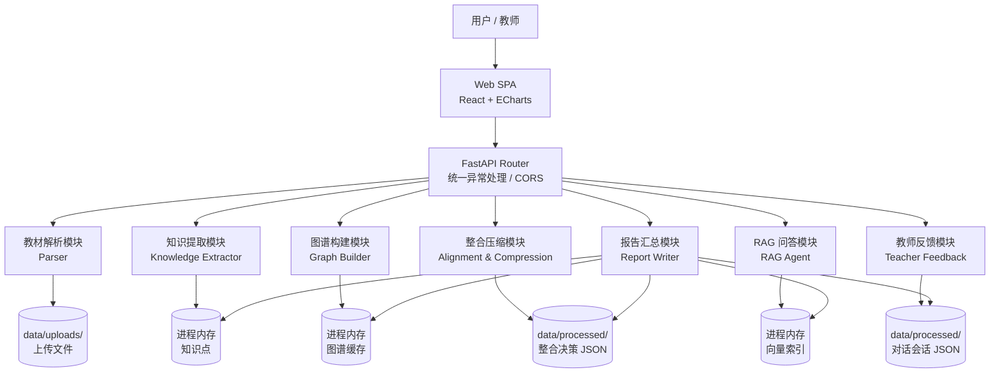
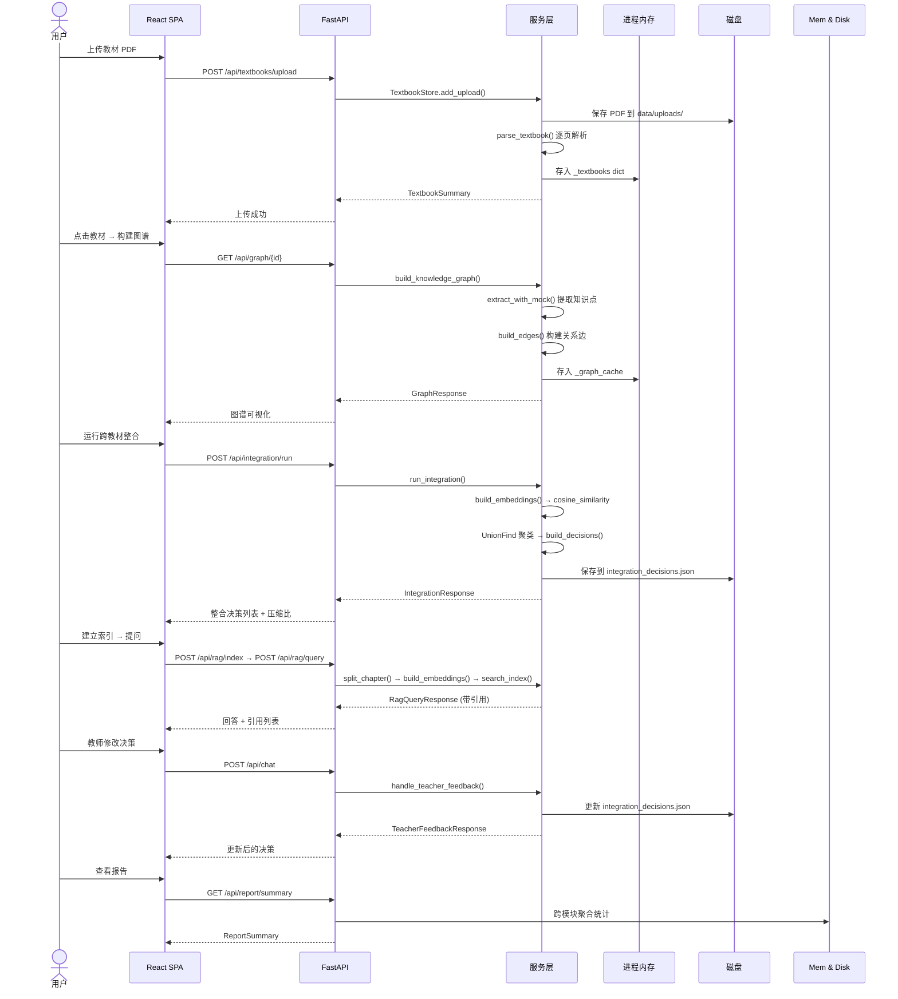

# Agent 架构说明

## 架构总览

本系统采用"编排器 + 专职模块"的架构风格，每个模块拥有明确的职责边界和独立的 fallback 策略。模块间通过共享内存状态和文件持久化协调，不依赖外部 Agent 框架。

## 模块职责

### 教材解析模块 (Parser)

**文件**：`services/textbook_parser.py`

| 维度 | 说明 |
|------|------|
| 输入 | PDF / Markdown / TXT 文件路径 |
| 输出 | `ParsedTextbook`（含章节列表，每章有 page_start/page_end/content/char_count） |
| 核心算法 | PyMuPDF 逐页提取文本 → 扫描每页前 8 行识别章节标题 → 按章节边界归并内容 |
| Fallback | 章节检测失败时按每 5 页切割默认章节 |
| 局限 | 不利用字体/字号特征，对大标题使用变体艺术字的 PDF 可能识别不全 |

### 知识提取模块 (Knowledge Extractor)

**文件**：`services/graph_service.py` 中的 `extract_with_mock()` / `extract_with_llm()`

| 维度 | 说明 |
|------|------|
| 输入 | 单本教材 + 单个章节 |
| 输出 | `list[ConceptCandidate]`（每项含 id/name/definition/category/source_text） |
| Mock 模式 | 用 `KEYWORD_PATTERN` 正则匹配医学术语（如 "心血管系统"、"炎性反应"），按句式和关键词分类为 6 个类别 |
| LLM 模式 | 向 OpenAI 兼容 API 发送 prompt，要求输出 JSON，返回后验证 `source_text` 是否在原文中存在 |
| 取舍 | Mock 模式牺牲覆盖率和准确度，换取零依赖和确定性；LLM 模式覆盖更全但增加延迟和 API 依赖 |
| 创新点 | LLM 模式输出经过 `source_text` 存在性校验——若模型返回的原文片段不在章节原文中，则丢弃该节点。这防止了模型编造医学内容 |

### 图谱构建模块 (Graph Builder)

**文件**：`services/graph_service.py` 中的 `build_edges()`

| 维度 | 说明 |
|------|------|
| 输入 | 知识点列表 + 原文句子 |
| 输出 | 带四类关系边的知识图谱：`contains`（主题→术语）、`prerequisite`（顺序依赖）、`parallel`（同类并列）、`applies_to`（功能指向） |
| 边构建逻辑 | 章节内 topic 节点 contains 术语节点；连续出现的术语建立 prerequisite；同类别术语建立 parallel（上限 4 条）；触发 `APPLIES_TRIGGER_PATTERN` 的建立 applies_to |
| 局限 | 跨章节的关系仅依赖规则匹配，不进行语义推理 |

### 整合压缩模块 (Alignment & Compression)

**文件**：`services/integration_service.py` + `services/integration_state.py`

| 维度 | 说明 |
|------|------|
| 输入 | 多本教材的图谱（GraphResponse） |
| 输出 | 整合决策列表 + 压缩统计（≤30% 压缩比） |
| 候选召回 | 跨教材节点配对 → cosine_similarity → 按 RELATED_THRESHOLD(0.38) / SAME_CONCEPT_THRESHOLD(0.78) 分类 |
| 聚类策略 | 使用并查集（Union-Find）对判定为 `same_concept` 的节点进行聚类，生成 merge 决策 |
| 压缩预算 | `enforce_compression_budget()` 按比例限制各决策的 result_node 字数 |
| 持久化 | 双写：内存 `_latest_response` + JSON 文件（`data/processed/integration_decisions.json`），支持重启恢复 |
| 取舍 | 本地 hash embedding（256 维 SHA-1 n-gram）牺牲语义精度，换取零依赖和确定性；在线 embedding 精度更高但增加延迟和外部依赖 |
| 创新点 | 并查集聚类 + 压缩预算强制 ≤30%，确保整合后知识"浓缩"；所有决策可编辑且记录 `manually_edited` 标志 |

### RAG 问答模块 (RAG Agent)

**文件**：`services/rag_service.py`

| 维度 | 说明 |
|------|------|
| 输入 | 已解析教材 + 自然语言问题 |
| 输出 | 带原文引用的回答（`[教材, 章节, 页码]` 格式） |
| 分块策略 | 700 字 chunk / 80 字重叠，边界对齐句子结尾 |
| 索引 | 384 维 hash embedding + 内存 cosine search |
| 答案生成 | 优先 LLM（带引用格式约束的 prompt），fallback 为摘取式答案 |
| Fallback | LLM 不可用时，选取与问题 token 重叠最高的句子返回，标注出处；知识库未覆盖时返回固定兜底话术 |
| 局限性 | 内存索引不支持 FAISS/ChromaDB 的量级和检索质量；hash embedding 对中文语义的区分度有限 |
| 创新点 | LLM 回答必须包含 `[...]` 引用标记才被接受，否则降级为摘取式答案；在线 embedding 通过多级环境变量 fallback chains 自动探测 |

### 教师反馈模块 (Teacher Feedback)

**文件**：`services/chat_service.py`

| 维度 | 说明 |
|------|------|
| 输入 | 教师自然语言消息 + 可选决策 ID + 对话历史 |
| 输出 | 意图识别结果 + 助手回答 + 更新后的决策（如有修改） |
| 意图解析 | 关键词规则：`改为/修改/调整` → modify；`为什么/为何` → explain；其他 → clarify |
| 决策修改 | 调用 `integration_state.update_decision()`，标记 `manually_edited=True`，记录 `build_manual_reason()` |
| 持久化 | 会话写入 `data/processed/chat_sessions.json`，前端额外 localStorage 缓存 |
| 局限 | 意图解析为规则匹配，无法理解复杂自然语言修改请求；不支持多步修改确认 |

### 报告汇总模块 (Report Writer)

**文件**：`api/report.py`

| 维度 | 说明 |
|------|------|
| 输入 | 所有模块的实时状态 |
| 输出 | `ReportSummary` JSON（教材数、章节数、图谱节点/边数、整合统计、RAG 状态、对话会话数） |
| 数据来源 | 跨模块读取 TextbookStore、_graph_cache、integration_state、_latest_index、chat_sessions |
| 创新点 | 报告数字全部来自系统真实状态，不硬编码；前端每加载报告 Tab 时重新拉取，反映最新操作结果 |

## 数据流全链路

## 设计取舍

| 取舍 | 选择 | 理由 |
|------|------|------|
| 单文件 React vs 组件拆分 | 单文件 App.tsx | 黑客松时间约束，1700 行仍在可维护范围内；所有类型和函数在同一文件中便于快速修改 |
| 进程内存 vs 数据库 | 进程内存（+ JSON 文件备份） | 教材数量 ≤7，数据量可控；零外部依赖、零配置；比赛演示不涉及并发写入 |
| Mock 规则 vs LLM | 二者并存，可切换 | Mock 保证确定性演示；LLM 提供更好的知识覆盖；通过 `GRAPH_EXTRACTOR_MODE` 环境变量切换 |
| Hash embedding vs 真实模型 | Hash 为 fallback | 在线模型不可用时系统仍可运行；代价是语义检索质量下降 |
| ECharts vs Cytoscape.js | ECharts 6 | 更熟悉的 API；内置 force layout；同时支持缩放、拖拽、点击；中文文档更完善 |
| 单仓库 vs 前后端分离 | 单仓库 | 简化部署和版本管理；render.yaml 已支持分别部署 |

## 局限性

1. **TextbookStore 非持久**：教材列表和章节数据仅存于进程内存，服务重启后需重新上传。解析后的文件保留在 `data/uploads/`，但 Store 不会从磁盘恢复。
2. **图谱缓存非持久**：图谱数据不落盘，重启后需重新构建。
3. **RAG 索引非持久**：不支持 FAISS/ChromaDB 索引文件保存，每次重启需重新索引。
4. **Hash embedding 精度有限**：本地 256/384 维 SHA-1 hash 向量仅提供粗粒度的文本相似度，对近义词、英文术语缩写的区分能力弱于真实 embedding 模型。
5. **意图解析为规则匹配**：教师反馈模块仅能识别明确的修改关键词（"改为合并"、"修改为保留"），无法理解复杂的自然语言指令。
6. **不支持并发**：所有状态使用全局变量和 dict，非线程安全。
7. **大 PDF 内存占用**：PyMuPDF 虽逐页解析，但解析后的完整文本仍在内存中持有。

## 创新点

1. **LLM 提取的 source_text 校验**：知识提取的 LLM 模式中，模型返回的每个知识点的 `source_text` 都经过原文存在性验证——如果原文中找不到该片段，则丢弃该节点。这在提升知识覆盖的同时保证了医学内容的可追溯性。
2. **多级 embedding fallback**：embedding 环境变量存在优先级 fallback chain（`RAG_EMBEDDING_BASE_URL` → `EMBEDDING_BASE_URL` → `LLM_BASE_URL`），最大化利用已有配置，减少用户配置负担。
3. **摘取式答案 fallback**：RAG 在没有 LLM 时不是直接报错，而是通过 token 重叠度选取最相关的句子作为"答案"，并保留引用格式。这保证了在任何情况下都能返回"有据可查"的结果。
4. **并查集聚类 + 30% 压缩预算**：跨教材整合使用 UnionFind 聚类同义概念，并通过 `enforce_compression_budget()` 强制压缩比 ≤30%，确保整合后的知识"浓缩"而非"缩水"。
5. **引用格式强制校验**：LLM 生成的 RAG 答案必须包含 `[...]` 格式的引用标记才被接受，否则自动降级为摘取式答案。这确保了答案的"可追溯性"不被模型幻觉破坏。
6. **零外部依赖即可运行的 mock 全链路**：整个系统在未配置任何 LLM/Embedding API 的情况下，完全通过规则提取 + hash embedding + 摘取式答案跑通上传→图谱→整合→RAG→反馈→报告的完整闭环。
