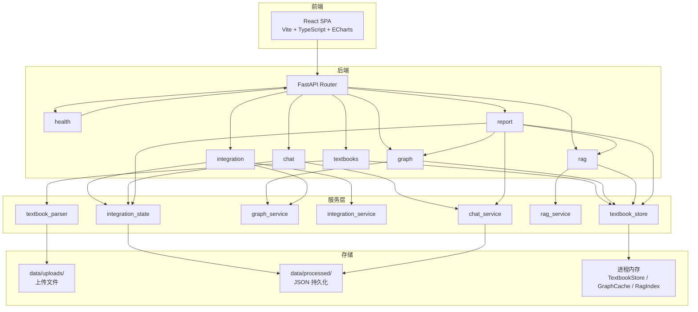

# 系统设计

## 架构概览



## 数据流

### 上传 → 解析
```
用户选择文件 → POST /api/textbooks/upload
  → TextbookStore.add_upload()
    → 保存文件到 data/uploads/{id}.pdf
    → textbook_parser.parse_textbook()
      → PyMuPDF 逐页提取 / MD 标题分割 / TXT 正则
    → 产出 TextbookDetail (chapters + chapter content)
    → 存入进程内存 _textbooks dict
```

### 图谱构建
```
POST /api/graph/build → resolve_textbooks()
  → graph_service.build_knowledge_graph()
    → extract_with_mock() 或 extract_with_llm()
      → 每章提取 3-20 个知识点
    → build_edges() 构建四类关系
  → 存入 _graph_cache (key = sorted|joined textbook_ids)
  → 返回 GraphResponse
```

### 跨教材整合
```
POST /api/integration/run → resolve_textbooks() [需要 ≥2 本]
  → graph_service.build_knowledge_graph()
  → integration_service.run_integration()
    → build_embeddings() → 在线 API 或 local_embedding (hash n-gram)
    → recall_candidates() → 跨教材配对 + cosine_similarity
    → build_decisions() → UnionFind 聚类 → merge/keep/remove
    → enforce_compression_budget() → ≤30% 压缩
  → integration_state.set_integration_response()
    → 内存 + JSON 文件双写
```

### RAG 问答
```
POST /api/rag/index → resolve_textbooks()
  → rag_service.build_rag_index()
    → split_chapter() → 700 字 chunk / 80 字重叠
    → build_embeddings() → 在线或 local hash
  → 存入 _latest_index (内存)

POST /api/rag/query
  → rag_service.query_rag()
    → search_index() → cosine_similarity top-5
    → try_llm_answer() 或 make_extractive_answer()
      → 仅使用检索 chunk，不补充模型知识
  → 返回带引用 [教材, 章节, 页码] 的回答
```

### 教师反馈
```
POST /api/chat
  → chat_service.handle_teacher_feedback()
    → 加载/创建会话
    → parse_requested_action() 解析意图
    → 解释：build_explanation() 展示决策详情
    → 修改：apply_teacher_action() → integration_state.update_decision()
      → 更新 JSON 持久化
    → 保存会话到 data/processed/chat_sessions.json
```

## API 设计

| 方法 | 路径 | 用途 |
|------|------|------|
| GET | `/api/health` | 健康检查 |
| POST | `/api/textbooks/upload` | 上传教材（multipart） |
| GET | `/api/textbooks` | 教材列表 |
| GET | `/api/textbooks/{id}` | 教材详情 |
| POST | `/api/graph/build` | 构建知识图谱 |
| GET | `/api/graph/{textbook_id}` | 获取图谱 |
| POST | `/api/integration/run` | 运行跨教材整合 |
| GET | `/api/integration/decisions` | 获取整合决策 |
| PATCH | `/api/integration/decisions/{id}` | 修改决策 |
| POST | `/api/rag/index` | 建立 RAG 索引 |
| POST | `/api/rag/query` | RAG 问答 |
| GET | `/api/rag/status` | 索引状态 |
| POST | `/api/chat` | 教师反馈 |
| GET | `/api/report/summary` | 报告摘要 |

所有错误返回统一格式：`{ error_code, message, detail, path }`

## 存储设计

| 数据 | 存储方式 | 持久化 | 重启后 |
|------|---------|--------|--------|
| 上传文件 | 磁盘 `data/uploads/` | 是 | 保留 |
| TextbookDetail | 进程内存 `store._textbooks` | 否 | 丢失（需重新上传） |
| 知识图谱 | 进程内存 `_graph_cache` | 否 | 丢失（需重新构建） |
| 整合决策 | 内存 `_latest_response` + JSON 文件 | 是 | 保留（从文件恢复） |
| 对话会话 | 内存 `_sessions` + JSON 文件 | 是 | 保留（从文件恢复） |
| RAG 索引 | 进程内存 `_latest_index` | 否 | 丢失（需重新索引） |

**容错设计**：整合决策和对话会话通过 `data/processed/*.json` 实现文件持久化。TextbookStore、图谱缓存、RAG 索引在重启后丢失，需重新操作，但核心数据（整合结论和对话记录）不丢失。

## Fallback 策略

| 场景 | 主方案 | Fallback |
|------|--------|----------|
| 图谱知识点提取 | LLM API (`mode=llm`) | 规则提取 (`mode=mock`)：按关键词正则 + 句式结构 |
| Embedding 计算 | 在线 API (OpenAI 兼容) | 本地 hash embedding：SHA-1 n-gram 哈希向量 |
| RAG 答案生成 | LLM API (带引用 prompt) | 摘取式答案：选与问题 token 重叠最高的句子 |
| PDF 章节识别 | 标题正则匹配 | 按固定页数分块 (每 5 页) |
| 文件编码 | UTF-8 | GB18030 |

## 技术选型

| 层 | 选择 | 理由 |
|----|------|------|
| 后端框架 | FastAPI + Pydantic v2 | 类型安全、自动文档、异步支持 |
| PDF 解析 | PyMuPDF (fitz) | 逐页流式处理、大文件不 OOM |
| 前端框架 | React 18 + Vite + TypeScript | 快速 HMR、静态构建 |
| 图谱可视化 | ECharts 6 (force layout) | 开箱即用的力导向图、支持缩放拖拽 |
| 图标 | Lucide React | Tree-shakable、风格统一 |
| 向量相似度 | Cosine (numpy-free 纯 Python) | 零额外依赖 |
| LLM/Embedding | 环境变量可配的 OpenAI 兼容 API | 灵活切换提供方 |

## 前端架构

单文件 React 组件 (`App.tsx`)，三栏布局：
- **左侧** (340px)：上传区 + 统计条 + 教材列表
- **中间** (flex 1)：ECharts 知识图谱 + 工具栏
- **右侧** (380px)：Tab 导航 + 节点详情 + 功能面板

四个 Tab：整合（默认）、RAG、对话、报告。全部状态管理使用 React useState/useEffect，API 调用使用原生 fetch。图表选项由 `createGraphOption()` 生成，通过 `blendHex()` 实现教材颜色渐变。
